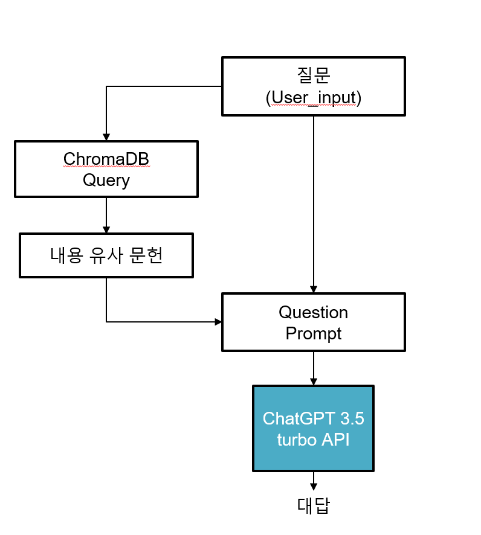
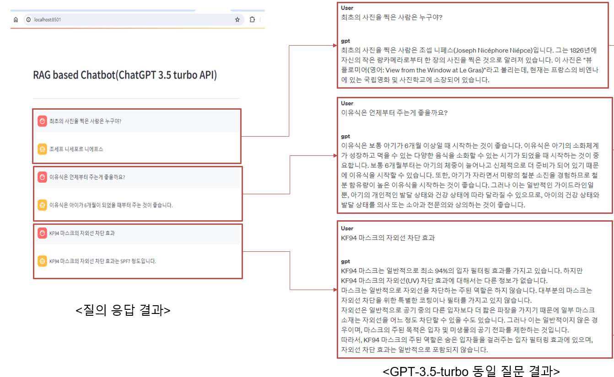

# RAG Chatbot

### 0. 프로젝트 목적

- 오픈소스 llm과 prompt를 실제로 활용해보기 위해 시작
- llm을 불러오면 그에 맞춰 prompt를 짜고 새롭게 만들어야 되기 때문에 프로젝트 시작
- langchain을 활용해서 llm과 prompt를 하나로 묶어 활용
- 챗봇을 만들기 위한 기본적인 toy project의 목적도 포함

 

---

### 1. 챗봇의 구현
- RAG(Retrieval Augmented Generation)
  - LLM과 연동하여 DB 데이터를 프롬프트에 추가하여 환각(Hallucination) 현상을 개선한 방법론
  - LLM은 NLG_CustomLLM()을 활용해 오픈소스로 공개된 모델을 다운받아 수행
  - vectorDB는 ChromaDB 활용
  - NLU는 torch 모델을 활용한 경우만 상정

 

---

### 2. 챗봇 모델 플로우차트

 

---

### 3. 챗봇 모델 결과물

 

